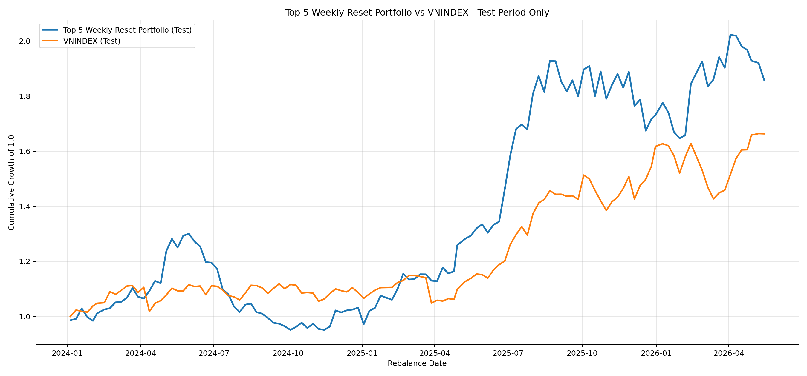

# Buy-Only Results (From `outputs/predictions/only_buy`)

## Files Used
- `outputs/predictions/only_buy/weekly_prediction_scores.csv`
- `outputs/predictions/only_buy/weekly_top_5_portfolio.csv`
- `outputs/predictions/only_buy/weekly_top_5_v2_full_reset_performance.csv`
- `outputs/predictions/only_buy/weekly_top_5_v2_full_reset_cost_sensitivity.csv`

## Test Window
- Start: `2024-01-01`
- Weeks: `122`
## Base Fee Scenario (`fee_rate = 0.0025`)
- Portfolio total return (test): `0.858140`
- VNINDEX total return (test): `0.663465`

## Latest Weekly Top-5 Portfolio Snapshot
Rebalance date: `2026-05-15` (next rebalance: `2026-05-19`)

| rank | ticker | portfolio_weight | p_buy | score | next_week_return |
|---:|:---|---:|---:|---:|---:|
| 1 | NVL | 0.2 | 0.484780 | 0.232726 | -0.035298 |
| 2 | FIR | 0.2 | 0.419932 | 0.212832 | -0.045462 |
| 3 | TDH | 0.2 | 0.389631 | 0.180811 | 0.012837 |
| 4 | VRE | 0.2 | 0.434811 | 0.154611 | -0.014815 |
| 5 | HII | 0.2 | 0.442091 | 0.154472 | -0.072817 |

## Notes
- Portfolio holdings are in `weekly_top_5_portfolio.csv` (5 stocks per rebalance week).
- The current `score` column in the exported table is the model ranking score from the pipeline run that generated these files.

## Full Test Top-5 Trading Portfolio
- Source: `outputs/predictions/only_buy/weekly_top_5_portfolio.csv`
- Filter: `rebalance_date >= 2024-01-01`
- Order: latest to oldest by `rebalance_date`; rank ascending within week
- Rows: `610` (expected 5 per week)

| rebalance_date   | next_rebalance_date   | ticker   |   rank |   portfolio_weight |    p_buy |    score |   next_week_return |
|:-----------------|:----------------------|:---------|-------:|-------------------:|---------:|---------:|-------------------:|
| 2026-05-15       | 2026-05-19            | NVL      |      1 |                0.2 | 0.48478  | 0.232726 |          -0.035298 |
| 2026-05-15       | 2026-05-19            | FIR      |      2 |                0.2 | 0.419932 | 0.212832 |          -0.045462 |
| 2026-05-15       | 2026-05-19            | TDH      |      3 |                0.2 | 0.389631 | 0.180811 |           0.012837 |
| 2026-05-15       | 2026-05-19            | VRE      |      4 |                0.2 | 0.434811 | 0.154611 |          -0.014815 |
| 2026-05-15       | 2026-05-19            | HII      |      5 |                0.2 | 0.442091 | 0.154472 |          -0.072817 |
| 2026-05-08       | 2026-05-15            | HTN      |      1 |                0.2 | 0.449123 | 0.226445 |           0.024693 |
| 2026-05-08       | 2026-05-15            | MSB      |      2 |                0.2 | 0.452618 | 0.200958 |           0.029199 |
| 2026-05-08       | 2026-05-15            | ADS      |      3 |                0.2 | 0.334695 | 0.172069 |           0.025571 |
| 2026-05-08       | 2026-05-15            | HUB      |      4 |                0.2 | 0.369849 | 0.131335 |          -0.052251 |
| 2026-05-08       | 2026-05-15            | BFC      |      5 |                0.2 | 0.424779 | 0.124286 |          -0.039098 |
| 2026-04-29       | 2026-05-08            | VPG      |      1 |                0.2 | 0.471409 | 0.21604  |           0.002861 |
| 2026-04-29       | 2026-05-08            | HID      |      2 |                0.2 | 0.449593 | 0.182992 |          -0.037993 |
| 2026-04-29       | 2026-05-08            | PLP      |      3 |                0.2 | 0.431162 | 0.176729 |          -0.040094 |
| 2026-04-29       | 2026-05-08            | TLH      |      4 |                0.2 | 0.33771  | 0.166781 |          -0.004301 |
| 2026-04-29       | 2026-05-08            | LGL      |      5 |                0.2 | 0.451124 | 0.14081  |          -0.007981 |
| 2026-04-24       | 2026-04-29            | HAR      |      1 |                0.2 | 0.360274 | 0.180872 |          -0.002853 |
| 2026-04-24       | 2026-04-29            | DCL      |      2 |                0.2 | 0.412783 | 0.155317 |           0        |
| 2026-04-24       | 2026-04-29            | ST8      |      3 |                0.2 | 0.37665  | 0.153834 |          -0.006061 |
| 2026-04-24       | 2026-04-29            | TNI      |      4 |                0.2 | 0.429367 | 0.137496 |           0        |
| 2026-04-24       | 2026-04-29            | SHB      |      5 |                0.2 | 0.369462 | 0.134893 |          -0.013652 |
| 2026-04-17       | 2026-04-24            | HT1      |      1 |                0.2 | 0.414318 | 0.226976 |          -0.003317 |
| 2026-04-17       | 2026-04-24            | EVG      |      2 |                0.2 | 0.456735 | 0.1942   |          -0.014859 |
| 2026-04-17       | 2026-04-24            | VAB      |      3 |                0.2 | 0.372694 | 0.189594 |          -0.019324 |
| 2026-04-17       | 2026-04-24            | NHA      |      4 |                0.2 | 0.415787 | 0.174338 |          -0.030191 |
| 2026-04-17       | 2026-04-24            | TTF      |      5 |                0.2 | 0.38431  | 0.171518 |          -0.015267 |
| 2026-04-10       | 2026-04-17            | CIG      |      1 |                0.2 | 0.44324  | 0.224175 |          -0.014481 |
| 2026-04-10       | 2026-04-17            | BCE      |      2 |                0.2 | 0.385234 | 0.21195  |          -0.004556 |
| 2026-04-10       | 2026-04-17            | HSL      |      3 |                0.2 | 0.489193 | 0.211645 |           0.007968 |
| 2026-04-10       | 2026-04-17            | APG      |      4 |                0.2 | 0.458605 | 0.177446 |           0.009737 |
| 2026-04-10       | 2026-04-17            | TDP      |      5 |                0.2 | 0.429247 | 0.165821 |           0.00508  |
| 2026-04-03       | 2026-04-10            | PVT      |      1 |                0.2 | 0.485294 | 0.275447 |           0.061875 |
| 2026-04-03       | 2026-04-10            | TCH      |      2 |                0.2 | 0.481094 | 0.247606 |           0.029853 |
| 2026-04-03       | 2026-04-10            | TNT      |      3 |                0.2 | 0.466833 | 0.246057 |           0.130116 |
| 2026-04-03       | 2026-04-10            | VCG      |      4 |                0.2 | 0.440332 | 0.234936 |           0.06556  |
| 2026-04-03       | 2026-04-10            | REE      |      5 |                0.2 | 0.440224 | 0.232928 |           0.021567 |
| 2026-03-27       | 2026-04-03            | TNT      |      1 |                0.2 | 0.453368 | 0.248315 |          -0.060472 |
| 2026-03-27       | 2026-04-03            | APG      |      2 |                0.2 | 0.463206 | 0.217901 |          -0.019316 |
| 2026-03-27       | 2026-04-03            | VSC      |      3 |                0.2 | 0.39722  | 0.194069 |           0.002103 |
| 2026-03-27       | 2026-04-03            | TCH      |      4 |                0.2 | 0.45007  | 0.16293  |          -0.012048 |
| 2026-03-27       | 2026-04-03            | HSL      |      5 |                0.2 | 0.409027 | 0.150744 |           0        |
| 2026-03-20       | 2026-03-27            | PC1      |      1 |                0.2 | 0.477863 | 0.268046 |           0.087949 |
| 2026-03-20       | 2026-03-27            | BSR      |      2 |                0.2 | 0.519048 | 0.202864 |          -0.016173 |
| 2026-03-20       | 2026-03-27            | KLB      |      3 |                0.2 | 0.44382  | 0.176422 |           0.019194 |
| 2026-03-20       | 2026-03-27            | PAN      |      4 |                0.2 | 0.428944 | 0.175755 |           0.065091 |
| 2026-03-20       | 2026-03-27            | DRH      |      5 |                0.2 | 0.441558 | 0.152607 |           0.066561 |
| 2026-03-13       | 2026-03-20            | PDV      |      1 |                0.2 | 0.464073 | 0.285713 |          -0.03882  |
| 2026-03-13       | 2026-03-20            | BTP      |      2 |                0.2 | 0.437198 | 0.265193 |           0.021202 |
| 2026-03-13       | 2026-03-20            | CSV      |      3 |                0.2 | 0.455886 | 0.242387 |          -0.030225 |
| 2026-03-13       | 2026-03-20            | ABS      |      4 |                0.2 | 0.481265 | 0.240034 |           0.125839 |
| 2026-03-13       | 2026-03-20            | ANT      |      5 |                0.2 | 0.481946 | 0.2273   |          -0.004064 |
| 2026-03-06       | 2026-03-13            | CIG      |      1 |                0.2 | 0.506297 | 0.252885 |          -0.06627  |
| 2026-03-06       | 2026-03-13            | ASP      |      2 |                0.2 | 0.462278 | 0.244551 |           0.020203 |
| 2026-03-06       | 2026-03-13            | GVR      |      3 |                0.2 | 0.512186 | 0.202859 |          -0.104625 |
| 2026-03-06       | 2026-03-13            | TSC      |      4 |                0.2 | 0.423812 | 0.191359 |          -0.035932 |
| 2026-03-06       | 2026-03-13            | PC1      |      5 |                0.2 | 0.458691 | 0.18975  |          -0.049145 |
| 2026-02-27       | 2026-03-06            | VNE      |      1 |                0.2 | 0.472596 | 0.224319 |          -0.054808 |
| 2026-02-27       | 2026-03-06            | PLX      |      2 |                0.2 | 0.487065 | 0.199779 |           0.070146 |
| 2026-02-27       | 2026-03-06            | PVT      |      3 |                0.2 | 0.460334 | 0.17095  |           0.244128 |
| 2026-02-27       | 2026-03-06            | VSC      |      4 |                0.2 | 0.429012 | 0.155622 |          -0.061711 |
| 2026-02-27       | 2026-03-06            | TCO      |      5 |                0.2 | 0.419717 | 0.149    |          -0.002004 |
| 2026-02-13       | 2026-02-27            | C32      |      1 |                0.2 | 0.45318  | 0.258667 |           0.008439 |
| 2026-02-13       | 2026-02-27            | HPX      |      2 |                0.2 | 0.44623  | 0.195012 |           0.028876 |
| 2026-02-13       | 2026-02-27            | DRH      |      3 |                0.2 | 0.485778 | 0.182184 |           0.21487  |
| 2026-02-13       | 2026-02-27            | BID      |      4 |                0.2 | 0.429416 | 0.180013 |           0.021098 |
| 2026-02-13       | 2026-02-27            | BSR      |      5 |                0.2 | 0.451903 | 0.173495 |           0.241745 |
| 2026-02-06       | 2026-02-13            | BSR      |      1 |                0.2 | 0.538311 | 0.306655 |          -0.002039 |
| 2026-02-06       | 2026-02-13            | SMC      |      2 |                0.2 | 0.493394 | 0.29966  |          -0.035789 |
| 2026-02-06       | 2026-02-13            | BID      |      3 |                0.2 | 0.466991 | 0.217903 |          -0.09162  |
| 2026-02-06       | 2026-02-13            | GEE      |      4 |                0.2 | 0.502365 | 0.215764 |           0.067341 |
| 2026-02-06       | 2026-02-13            | PNJ      |      5 |                0.2 | 0.41972  | 0.213442 |           0.096975 |
| 2026-01-30       | 2026-02-06            | POW      |      1 |                0.2 | 0.490643 | 0.29314  |          -0.018349 |
| 2026-01-30       | 2026-02-06            | DRH      |      2 |                0.2 | 0.550484 | 0.282137 |           0.100083 |
| 2026-01-30       | 2026-02-06            | DLG      |      3 |                0.2 | 0.536184 | 0.271805 |          -0.16782  |
| 2026-01-30       | 2026-02-06            | PET      |      4 |                0.2 | 0.470686 | 0.262527 |           0.009331 |
| 2026-01-30       | 2026-02-06            | MHC      |      5 |                0.2 | 0.482622 | 0.256324 |           0.002026 |
| 2026-01-23       | 2026-01-30            | VSC      |      1 |                0.2 | 0.48103  | 0.249603 |          -0.05891  |
| 2026-01-23       | 2026-01-30            | HT1      |      2 |                0.2 | 0.431958 | 0.21196  |          -0.102326 |
| 2026-01-23       | 2026-01-30            | ANT      |      3 |                0.2 | 0.445524 | 0.198431 |           0.015092 |
| 2026-01-23       | 2026-01-30            | HVN      |      4 |                0.2 | 0.430695 | 0.190865 |          -0.025642 |
| 2026-01-23       | 2026-01-30            | DRC      |      5 |                0.2 | 0.392503 | 0.187983 |          -0.029559 |
| 2026-01-16       | 2026-01-23            | PVT      |      1 |                0.2 | 0.488227 | 0.274962 |          -0.037087 |
| 2026-01-16       | 2026-01-23            | TVB      |      2 |                0.2 | 0.360814 | 0.201554 |          -0.024421 |
| 2026-01-16       | 2026-01-23            | PVP      |      3 |                0.2 | 0.411164 | 0.193295 |          -0.026938 |
| 2026-01-16       | 2026-01-23            | C47      |      4 |                0.2 | 0.45523  | 0.170521 |           0.008089 |
| 2026-01-16       | 2026-01-23            | BMC      |      5 |                0.2 | 0.377594 | 0.169974 |          -0.006309 |
| 2026-01-09       | 2026-01-16            | SAM      |      1 |                0.2 | 0.499688 | 0.307113 |           0.020479 |
| 2026-01-09       | 2026-01-16            | QCG      |      2 |                0.2 | 0.480519 | 0.25857  |           0.043172 |
| 2026-01-09       | 2026-01-16            | SMC      |      3 |                0.2 | 0.438336 | 0.218041 |           0.029414 |
| 2026-01-09       | 2026-01-16            | HII      |      4 |                0.2 | 0.476004 | 0.211036 |           0.042778 |
| 2026-01-09       | 2026-01-16            | TMT      |      5 |                0.2 | 0.443249 | 0.194749 |           0.003914 |
| 2025-12-31       | 2026-01-09            | LGL      |      1 |                0.2 | 0.45102  | 0.188142 |          -0.03837  |
| 2025-12-31       | 2026-01-09            | DCL      |      2 |                0.2 | 0.433669 | 0.148543 |           0.081473 |
| 2025-12-31       | 2026-01-09            | HVH      |      3 |                0.2 | 0.303902 | 0.136749 |          -0.030305 |
| 2025-12-31       | 2026-01-09            | GSP      |      4 |                0.2 | 0.262582 | 0.129644 |           0.0331   |
| 2025-12-31       | 2026-01-09            | TLD      |      5 |                0.2 | 0.260094 | 0.118005 |           0.001211 |
| 2025-12-26       | 2025-12-31            | QCG      |      1 |                0.2 | 0.507101 | 0.288118 |           0.06852  |
| 2025-12-26       | 2025-12-31            | HII      |      2 |                0.2 | 0.482797 | 0.214614 |           0.023027 |
| 2025-12-26       | 2025-12-31            | TTF      |      3 |                0.2 | 0.488477 | 0.195444 |           0.03279  |
| 2025-12-26       | 2025-12-31            | FCN      |      4 |                0.2 | 0.40074  | 0.170473 |          -0.013606 |
| 2025-12-26       | 2025-12-31            | ANT      |      5 |                0.2 | 0.417695 | 0.163618 |           0.024331 |
| 2025-12-19       | 2025-12-26            | TTF      |      1 |                0.2 | 0.554862 | 0.331713 |          -0.145542 |
| 2025-12-19       | 2025-12-26            | HAR      |      2 |                0.2 | 0.450036 | 0.238175 |          -0.034829 |
| 2025-12-19       | 2025-12-26            | DGC      |      3 |                0.2 | 0.48735  | 0.18424  |          -0.099333 |
| 2025-12-19       | 2025-12-26            | LPB      |      4 |                0.2 | 0.421082 | 0.180726 |          -0.047065 |
| 2025-12-19       | 2025-12-26            | BKG      |      5 |                0.2 | 0.361101 | 0.180048 |           0.003407 |
| 2025-12-12       | 2025-12-19            | ICT      |      1 |                0.2 | 0.501116 | 0.261352 |          -0.074901 |
| 2025-12-12       | 2025-12-19            | TMT      |      2 |                0.2 | 0.504258 | 0.246744 |           0.100805 |
| 2025-12-12       | 2025-12-19            | BKG      |      3 |                0.2 | 0.465474 | 0.226644 |          -0.003407 |
| 2025-12-12       | 2025-12-19            | TSC      |      4 |                0.2 | 0.488563 | 0.219195 |           0.019673 |
| 2025-12-12       | 2025-12-19            | HHP      |      5 |                0.2 | 0.468993 | 0.203138 |           0.027399 |
| 2025-12-05       | 2025-12-12            | ABS      |      1 |                0.2 | 0.505157 | 0.273678 |          -0.112025 |
| 2025-12-05       | 2025-12-12            | SMC      |      2 |                0.2 | 0.51718  | 0.240346 |          -0.074384 |
| 2025-12-05       | 2025-12-12            | DAH      |      3 |                0.2 | 0.354578 | 0.208935 |          -0.005291 |
| 2025-12-05       | 2025-12-12            | OGC      |      4 |                0.2 | 0.43309  | 0.206514 |          -0.024939 |
| 2025-12-05       | 2025-12-12            | PC1      |      5 |                0.2 | 0.454675 | 0.196211 |          -0.114542 |
| 2025-11-28       | 2025-12-05            | PLP      |      1 |                0.2 | 0.520669 | 0.236002 |           0.09891  |
| 2025-11-28       | 2025-12-05            | AFX      |      2 |                0.2 | 0.479597 | 0.192769 |           0        |
| 2025-11-28       | 2025-12-05            | PVD      |      3 |                0.2 | 0.425731 | 0.178167 |          -0.024646 |
| 2025-11-28       | 2025-12-05            | HAP      |      4 |                0.2 | 0.406553 | 0.145911 |           0.080668 |
| 2025-11-28       | 2025-12-05            | HAR      |      5 |                0.2 | 0.40432  | 0.143547 |           0.005013 |
| 2025-11-21       | 2025-11-28            | DRH      |      1 |                0.2 | 0.480306 | 0.261052 |           0.012903 |
| 2025-11-21       | 2025-11-28            | HQC      |      2 |                0.2 | 0.485558 | 0.223906 |          -0.062325 |
| 2025-11-21       | 2025-11-28            | SAM      |      3 |                0.2 | 0.427244 | 0.200425 |          -0.033403 |
| 2025-11-21       | 2025-11-28            | TSC      |      4 |                0.2 | 0.402996 | 0.189287 |           0.006601 |
| 2025-11-21       | 2025-11-28            | JVC      |      5 |                0.2 | 0.469115 | 0.188843 |          -0.046724 |
| 2025-11-14       | 2025-11-21            | HAG      |      1 |                0.2 | 0.426211 | 0.196848 |           0.008463 |
| 2025-11-14       | 2025-11-21            | SKG      |      2 |                0.2 | 0.33481  | 0.160085 |          -0.014742 |
| 2025-11-14       | 2025-11-21            | OGC      |      3 |                0.2 | 0.402594 | 0.158512 |           0.04879  |
| 2025-11-14       | 2025-11-21            | APH      |      4 |                0.2 | 0.327971 | 0.13322  |           0.074223 |
| 2025-11-14       | 2025-11-21            | CMX      |      5 |                0.2 | 0.320232 | 0.128493 |           0        |
| 2025-11-07       | 2025-11-14            | KHG      |      1 |                0.2 | 0.512595 | 0.287787 |          -0.033638 |
| 2025-11-07       | 2025-11-14            | MHC      |      2 |                0.2 | 0.508116 | 0.279631 |           0.06614  |
| 2025-11-07       | 2025-11-14            | DXS      |      3 |                0.2 | 0.470329 | 0.278915 |           0.02144  |
| 2025-11-07       | 2025-11-14            | VTP      |      4 |                0.2 | 0.464691 | 0.263592 |           0.012223 |
| 2025-11-07       | 2025-11-14            | DRH      |      5 |                0.2 | 0.477549 | 0.263243 |           0.077625 |
| 2025-10-31       | 2025-11-07            | VRE      |      1 |                0.2 | 0.525047 | 0.298571 |          -0.060343 |
| 2025-10-31       | 2025-11-07            | VIC      |      2 |                0.2 | 0.50639  | 0.263702 |           0.044543 |
| 2025-10-31       | 2025-11-07            | MHC      |      3 |                0.2 | 0.506881 | 0.251994 |          -0.150481 |
| 2025-10-31       | 2025-11-07            | ORS      |      4 |                0.2 | 0.489754 | 0.242334 |          -0.041964 |
| 2025-10-31       | 2025-11-07            | VNE      |      5 |                0.2 | 0.487919 | 0.239153 |          -0.057987 |
| 2025-10-24       | 2025-10-31            | SMC      |      1 |                0.2 | 0.511419 | 0.248617 |           0.14531  |
| 2025-10-24       | 2025-10-31            | ABS      |      2 |                0.2 | 0.426035 | 0.226458 |           0.016807 |
| 2025-10-24       | 2025-10-31            | ADS      |      3 |                0.2 | 0.403623 | 0.21793  |           0.053088 |
| 2025-10-24       | 2025-10-31            | HHV      |      4 |                0.2 | 0.420056 | 0.215667 |           0.023777 |
| 2025-10-24       | 2025-10-31            | FCN      |      5 |                0.2 | 0.457657 | 0.207577 |           0.006614 |
| 2025-10-17       | 2025-10-24            | ABS      |      1 |                0.2 | 0.51276  | 0.245164 |          -0.016807 |
| 2025-10-17       | 2025-10-24            | DRH      |      2 |                0.2 | 0.481306 | 0.243883 |          -0.079667 |
| 2025-10-17       | 2025-10-24            | CII      |      3 |                0.2 | 0.468315 | 0.22387  |          -0.128133 |
| 2025-10-17       | 2025-10-24            | TCI      |      4 |                0.2 | 0.459301 | 0.189684 |          -0.052518 |
| 2025-10-17       | 2025-10-24            | SGR      |      5 |                0.2 | 0.444893 | 0.181965 |          -0.011561 |
| 2025-10-10       | 2025-10-17            | VMD      |      1 |                0.2 | 0.452388 | 0.288913 |           0        |
| 2025-10-10       | 2025-10-17            | HAP      |      2 |                0.2 | 0.414585 | 0.242339 |          -0.069419 |
| 2025-10-10       | 2025-10-17            | MHC      |      3 |                0.2 | 0.504161 | 0.226466 |          -0.048621 |
| 2025-10-10       | 2025-10-17            | HID      |      4 |                0.2 | 0.493845 | 0.213622 |           0.026589 |
| 2025-10-10       | 2025-10-17            | CII      |      5 |                0.2 | 0.447814 | 0.187385 |           0.124395 |
| 2025-10-03       | 2025-10-10            | PDR      |      1 |                0.2 | 0.510205 | 0.295416 |           0.09067  |
| 2025-10-03       | 2025-10-10            | SMC      |      2 |                0.2 | 0.51841  | 0.275815 |          -0.011561 |
| 2025-10-03       | 2025-10-10            | NKG      |      3 |                0.2 | 0.460319 | 0.249617 |           0.069392 |
| 2025-10-03       | 2025-10-10            | FCN      |      4 |                0.2 | 0.46174  | 0.243371 |           0.037945 |
| 2025-10-03       | 2025-10-10            | DIG      |      5 |                0.2 | 0.476009 | 0.22263  |           0.082772 |
| 2025-09-26       | 2025-10-03            | TEG      |      1 |                0.2 | 0.528717 | 0.327473 |          -0.007491 |
| 2025-09-26       | 2025-10-03            | NKG      |      2 |                0.2 | 0.449587 | 0.239773 |          -0.091492 |
| 2025-09-26       | 2025-10-03            | BKG      |      3 |                0.2 | 0.446829 | 0.23599  |          -0.009631 |
| 2025-09-26       | 2025-10-03            | CSM      |      4 |                0.2 | 0.433445 | 0.194799 |          -0.013514 |
| 2025-09-26       | 2025-10-03            | HII      |      5 |                0.2 | 0.37086  | 0.174263 |          -0.025318 |
| 2025-09-19       | 2025-09-26            | PDR      |      1 |                0.2 | 0.50332  | 0.299763 |           0.043711 |
| 2025-09-19       | 2025-09-26            | CII      |      2 |                0.2 | 0.497144 | 0.266795 |           0.135395 |
| 2025-09-19       | 2025-09-26            | MSB      |      3 |                0.2 | 0.487542 | 0.265084 |          -0.030077 |
| 2025-09-19       | 2025-09-26            | VND      |      4 |                0.2 | 0.491839 | 0.261648 |          -0.017778 |
| 2025-09-19       | 2025-09-26            | SAM      |      5 |                0.2 | 0.487401 | 0.257027 |          -0.023707 |
| 2025-09-12       | 2025-09-19            | PDR      |      1 |                0.2 | 0.540877 | 0.318286 |          -0.006363 |
| 2025-09-12       | 2025-09-19            | CCC      |      2 |                0.2 | 0.545106 | 0.303288 |           0.003334 |
| 2025-09-12       | 2025-09-19            | MSB      |      3 |                0.2 | 0.501838 | 0.296805 |          -0.025596 |
| 2025-09-12       | 2025-09-19            | TCH      |      4 |                0.2 | 0.486233 | 0.277598 |          -0.045091 |
| 2025-09-12       | 2025-09-19            | HTN      |      5 |                0.2 | 0.466491 | 0.249121 |          -0.013423 |
| 2025-09-05       | 2025-09-12            | VIB      |      1 |                0.2 | 0.496055 | 0.301923 |          -0.046069 |
| 2025-09-05       | 2025-09-12            | MBB      |      2 |                0.2 | 0.495231 | 0.280241 |          -0.029632 |
| 2025-09-05       | 2025-09-12            | TPB      |      3 |                0.2 | 0.519043 | 0.272483 |          -0.054945 |
| 2025-09-05       | 2025-09-12            | HDB      |      4 |                0.2 | 0.467179 | 0.271476 |          -0.024803 |
| 2025-09-05       | 2025-09-12            | ACB      |      5 |                0.2 | 0.459138 | 0.267462 |          -0.031808 |
| 2025-08-29       | 2025-09-05            | HAR      |      1 |                0.2 | 0.565562 | 0.337957 |           0.033336 |
| 2025-08-29       | 2025-09-05            | EVF      |      2 |                0.2 | 0.531854 | 0.333977 |          -0.00354  |
| 2025-08-29       | 2025-09-05            | VIB      |      3 |                0.2 | 0.515985 | 0.303523 |          -0.015519 |
| 2025-08-29       | 2025-09-05            | TPB      |      4 |                0.2 | 0.530472 | 0.29504  |          -0.014156 |
| 2025-08-29       | 2025-09-05            | SAM      |      5 |                0.2 | 0.526256 | 0.293412 |           0.00905  |
| 2025-08-22       | 2025-08-29            | PDR      |      1 |                0.2 | 0.549795 | 0.317483 |           0.022658 |
| 2025-08-22       | 2025-08-29            | HDG      |      2 |                0.2 | 0.512724 | 0.308015 |           0.003202 |
| 2025-08-22       | 2025-08-29            | DIG      |      3 |                0.2 | 0.515547 | 0.276595 |           0.026099 |
| 2025-08-22       | 2025-08-29            | VND      |      4 |                0.2 | 0.51833  | 0.276439 |           0.160178 |
| 2025-08-22       | 2025-08-29            | VIX      |      5 |                0.2 | 0.527048 | 0.267033 |           0.089013 |
| 2025-08-15       | 2025-08-22            | VRC      |      1 |                0.2 | 0.550785 | 0.323182 |           0.003604 |
| 2025-08-15       | 2025-08-22            | VND      |      2 |                0.2 | 0.520944 | 0.29149  |          -0.095513 |
| 2025-08-15       | 2025-08-22            | SHB      |      3 |                0.2 | 0.535289 | 0.288913 |          -0.067032 |
| 2025-08-15       | 2025-08-22            | HHV      |      4 |                0.2 | 0.481311 | 0.27355  |           0.023305 |
| 2025-08-15       | 2025-08-22            | CII      |      5 |                0.2 | 0.522384 | 0.268567 |          -0.012485 |
| 2025-08-08       | 2025-08-15            | DIG      |      1 |                0.2 | 0.543117 | 0.339134 |           0.021303 |
| 2025-08-08       | 2025-08-15            | DXG      |      2 |                0.2 | 0.521512 | 0.319836 |          -0.00939  |
| 2025-08-08       | 2025-08-15            | VIX      |      3 |                0.2 | 0.544079 | 0.307502 |           0.19677  |
| 2025-08-08       | 2025-08-15            | HAG      |      4 |                0.2 | 0.519685 | 0.30695  |          -0.015601 |
| 2025-08-08       | 2025-08-15            | HQC      |      5 |                0.2 | 0.51445  | 0.303989 |          -0.024939 |
| 2025-08-01       | 2025-08-08            | VAB      |      1 |                0.2 | 0.547537 | 0.280363 |           0.106641 |
| 2025-08-01       | 2025-08-08            | SSB      |      2 |                0.2 | 0.480989 | 0.268311 |           0.02519  |
| 2025-08-01       | 2025-08-08            | EVG      |      3 |                0.2 | 0.528858 | 0.248771 |           0.152    |
| 2025-08-01       | 2025-08-08            | CMX      |      4 |                0.2 | 0.483556 | 0.247488 |           0.058527 |
| 2025-08-01       | 2025-08-08            | HDB      |      5 |                0.2 | 0.457709 | 0.239342 |           0.038167 |
| 2025-07-25       | 2025-08-01            | DIG      |      1 |                0.2 | 0.507526 | 0.290408 |          -0.04452  |
| 2025-07-25       | 2025-08-01            | PDR      |      2 |                0.2 | 0.488184 | 0.277053 |          -0.026907 |
| 2025-07-25       | 2025-08-01            | EIB      |      3 |                0.2 | 0.488721 | 0.272656 |          -0.055673 |
| 2025-07-25       | 2025-08-01            | VIX      |      4 |                0.2 | 0.522999 | 0.270875 |           0.089021 |
| 2025-07-25       | 2025-08-01            | DXG      |      5 |                0.2 | 0.471309 | 0.255497 |          -0.010101 |
| 2025-07-18       | 2025-07-25            | HQC      |      1 |                0.2 | 0.530576 | 0.31415  |          -0.012485 |
| 2025-07-18       | 2025-07-25            | FIT      |      2 |                0.2 | 0.499783 | 0.297334 |           0.083548 |
| 2025-07-18       | 2025-07-25            | HAG      |      3 |                0.2 | 0.505204 | 0.294171 |          -0.055377 |
| 2025-07-18       | 2025-07-25            | DC4      |      4 |                0.2 | 0.506894 | 0.289812 |           0.028371 |
| 2025-07-18       | 2025-07-25            | NVL      |      5 |                0.2 | 0.526593 | 0.284199 |           0.008811 |
| 2025-07-11       | 2025-07-18            | HQC      |      1 |                0.2 | 0.540456 | 0.326361 |           0.074681 |
| 2025-07-11       | 2025-07-18            | HPX      |      2 |                0.2 | 0.486945 | 0.271935 |           0.099486 |
| 2025-07-11       | 2025-07-18            | ASP      |      3 |                0.2 | 0.450774 | 0.251246 |           0.00939  |
| 2025-07-11       | 2025-07-18            | FIT      |      4 |                0.2 | 0.45715  | 0.247007 |           0.048894 |
| 2025-07-11       | 2025-07-18            | TSC      |      5 |                0.2 | 0.47249  | 0.245025 |           0.061608 |
| 2025-07-04       | 2025-07-11            | NVL      |      1 |                0.2 | 0.509797 | 0.310929 |          -0.006601 |
| 2025-07-04       | 2025-07-11            | SVD      |      2 |                0.2 | 0.512801 | 0.28274  |           0.020087 |
| 2025-07-04       | 2025-07-11            | LDG      |      3 |                0.2 | 0.54333  | 0.244104 |           0.329905 |
| 2025-07-04       | 2025-07-11            | TEG      |      4 |                0.2 | 0.474809 | 0.235792 |          -0.012678 |
| 2025-07-04       | 2025-07-11            | FCM      |      5 |                0.2 | 0.410596 | 0.234695 |           0.045462 |
| 2025-06-27       | 2025-07-04            | PTL      |      1 |                0.2 | 0.489864 | 0.290569 |           0.007168 |
| 2025-06-27       | 2025-07-04            | NVL      |      2 |                0.2 | 0.453818 | 0.226557 |           0.013245 |
| 2025-06-27       | 2025-07-04            | HCD      |      3 |                0.2 | 0.381539 | 0.179827 |           0.068529 |
| 2025-06-27       | 2025-07-04            | LDG      |      4 |                0.2 | 0.501335 | 0.17711  |           0.263713 |
| 2025-06-27       | 2025-07-04            | HHP      |      5 |                0.2 | 0.330843 | 0.174507 |           0.051293 |
| 2025-06-20       | 2025-06-27            | GEX      |      1 |                0.2 | 0.483588 | 0.269555 |           0.060649 |
| 2025-06-20       | 2025-06-27            | CIG      |      2 |                0.2 | 0.445595 | 0.2502   |           0.018508 |
| 2025-06-20       | 2025-06-27            | NVL      |      3 |                0.2 | 0.480704 | 0.210586 |          -0.029559 |
| 2025-06-20       | 2025-06-27            | DAH      |      4 |                0.2 | 0.351563 | 0.197175 |          -0.003044 |
| 2025-06-20       | 2025-06-27            | PTL      |      5 |                0.2 | 0.445301 | 0.184036 |           0.003604 |
| 2025-06-13       | 2025-06-20            | GEX      |      1 |                0.2 | 0.44617  | 0.212467 |           0.035016 |
| 2025-06-13       | 2025-06-20            | SHB      |      2 |                0.2 | 0.453779 | 0.203516 |           0.015859 |
| 2025-06-13       | 2025-06-20            | VIX      |      3 |                0.2 | 0.393586 | 0.175679 |           0.015224 |
| 2025-06-13       | 2025-06-20            | MHC      |      4 |                0.2 | 0.3985   | 0.167552 |           0.024846 |
| 2025-06-13       | 2025-06-20            | PVD      |      5 |                0.2 | 0.424089 | 0.166051 |           0.029073 |
| 2025-06-06       | 2025-06-13            | VIX      |      1 |                0.2 | 0.463581 | 0.238486 |          -0.04132  |
| 2025-06-06       | 2025-06-13            | OGC      |      2 |                0.2 | 0.435148 | 0.224769 |          -0.029486 |
| 2025-06-06       | 2025-06-13            | DXS      |      3 |                0.2 | 0.523206 | 0.222642 |           0.016807 |
| 2025-06-06       | 2025-06-13            | DAH      |      4 |                0.2 | 0.378668 | 0.183453 |           0.003044 |
| 2025-06-06       | 2025-06-13            | CMX      |      5 |                0.2 | 0.373523 | 0.171547 |          -0.055362 |
| 2025-05-30       | 2025-06-06            | NVL      |      1 |                0.2 | 0.535989 | 0.277239 |           0.010545 |
| 2025-05-30       | 2025-06-06            | HAP      |      2 |                0.2 | 0.482849 | 0.259896 |           0.087011 |
| 2025-05-30       | 2025-06-06            | KLB      |      3 |                0.2 | 0.54197  | 0.231343 |          -0.073838 |
| 2025-05-30       | 2025-06-06            | SHB      |      4 |                0.2 | 0.499045 | 0.225522 |           0.010471 |
| 2025-05-30       | 2025-06-06            | LDG      |      5 |                0.2 | 0.458647 | 0.223329 |           0.02299  |
| 2025-05-23       | 2025-05-30            | VIX      |      1 |                0.2 | 0.507162 | 0.260991 |           0.018434 |
| 2025-05-23       | 2025-05-30            | LDG      |      2 |                0.2 | 0.449156 | 0.233941 |           0.042762 |
| 2025-05-23       | 2025-05-30            | CCL      |      3 |                0.2 | 0.439807 | 0.225725 |           0.035612 |
| 2025-05-23       | 2025-05-30            | OGC      |      4 |                0.2 | 0.421668 | 0.197218 |           0.007308 |
| 2025-05-23       | 2025-05-30            | SHB      |      5 |                0.2 | 0.482218 | 0.196395 |           0.003515 |
| 2025-05-16       | 2025-05-23            | SHB      |      1 |                0.2 | 0.53088  | 0.265487 |           0.004411 |
| 2025-05-16       | 2025-05-23            | VIX      |      2 |                0.2 | 0.44844  | 0.233165 |           0.026392 |
| 2025-05-16       | 2025-05-23            | NVL      |      3 |                0.2 | 0.46749  | 0.21626  |           0.024391 |
| 2025-05-16       | 2025-05-23            | TTF      |      4 |                0.2 | 0.402971 | 0.199583 |           0.003945 |
| 2025-05-16       | 2025-05-23            | ABS      |      5 |                0.2 | 0.41401  | 0.192531 |          -0.005602 |
| 2025-05-09       | 2025-05-16            | VIX      |      1 |                0.2 | 0.466085 | 0.268775 |           0.046929 |
| 2025-05-09       | 2025-05-16            | HTN      |      2 |                0.2 | 0.476691 | 0.267652 |           0.009809 |
| 2025-05-09       | 2025-05-16            | TCI      |      3 |                0.2 | 0.457738 | 0.264624 |           0.043749 |
| 2025-05-09       | 2025-05-16            | CII      |      4 |                0.2 | 0.449673 | 0.22762  |          -0.006987 |
| 2025-05-09       | 2025-05-16            | LCG      |      5 |                0.2 | 0.441458 | 0.227162 |           0.008005 |
| 2025-04-29       | 2025-05-09            | VIX      |      1 |                0.2 | 0.460221 | 0.234051 |           0.040864 |
| 2025-04-29       | 2025-05-09            | GEX      |      2 |                0.2 | 0.441496 | 0.228682 |           0.123858 |
| 2025-04-29       | 2025-05-09            | DRC      |      3 |                0.2 | 0.440223 | 0.203547 |           0.117545 |
| 2025-04-29       | 2025-05-09            | TCO      |      4 |                0.2 | 0.477096 | 0.192614 |           0.0648   |
| 2025-04-29       | 2025-05-09            | DPR      |      5 |                0.2 | 0.412322 | 0.175145 |           0.0538   |
| 2025-04-25       | 2025-04-29            | HVN      |      1 |                0.2 | 0.480977 | 0.269604 |           0.027276 |
| 2025-04-25       | 2025-04-29            | HVH      |      2 |                0.2 | 0.512649 | 0.241355 |           0.010904 |
| 2025-04-25       | 2025-04-29            | TCD      |      3 |                0.2 | 0.481761 | 0.22207  |          -0.015915 |
| 2025-04-25       | 2025-04-29            | SSB      |      4 |                0.2 | 0.387811 | 0.17288  |           0.016439 |
| 2025-04-25       | 2025-04-29            | LPB      |      5 |                0.2 | 0.377023 | 0.170054 |           0.007709 |
| 2025-04-18       | 2025-04-25            | SHB      |      1 |                0.2 | 0.521436 | 0.300741 |          -0.003707 |
| 2025-04-18       | 2025-04-25            | GEX      |      2 |                0.2 | 0.502037 | 0.292308 |          -0.016176 |
| 2025-04-18       | 2025-04-25            | TCH      |      3 |                0.2 | 0.492936 | 0.280103 |           0.055255 |
| 2025-04-18       | 2025-04-25            | VIX      |      4 |                0.2 | 0.502003 | 0.269987 |          -0.056524 |
| 2025-04-18       | 2025-04-25            | VND      |      5 |                0.2 | 0.464389 | 0.266004 |          -0.062563 |
| 2025-04-11       | 2025-04-18            | HHS      |      1 |                0.2 | 0.537154 | 0.319903 |           0.056089 |
| 2025-04-11       | 2025-04-18            | LPB      |      2 |                0.2 | 0.484363 | 0.280202 |          -0.008675 |
| 2025-04-11       | 2025-04-18            | TSC      |      3 |                0.2 | 0.486563 | 0.258548 |           0.068005 |
| 2025-04-11       | 2025-04-18            | VCG      |      4 |                0.2 | 0.453031 | 0.241767 |           0.051401 |
| 2025-04-11       | 2025-04-18            | HVN      |      5 |                0.2 | 0.482206 | 0.231072 |           0.058146 |
| 2025-04-04       | 2025-04-11            | SHB      |      1 |                0.2 | 0.559325 | 0.314723 |           0.007859 |
| 2025-04-04       | 2025-04-11            | VRC      |      2 |                0.2 | 0.518572 | 0.239687 |           0.040656 |
| 2025-04-04       | 2025-04-11            | JVC      |      3 |                0.2 | 0.503408 | 0.217916 |          -0.026907 |
| 2025-04-04       | 2025-04-11            | VIX      |      4 |                0.2 | 0.498611 | 0.212907 |          -0.008342 |
| 2025-04-04       | 2025-04-11            | TVB      |      5 |                0.2 | 0.461182 | 0.212583 |          -0.013245 |
| 2025-03-28       | 2025-04-04            | VIX      |      1 |                0.2 | 0.51402  | 0.30248  |          -0.044677 |
| 2025-03-28       | 2025-04-04            | DLG      |      2 |                0.2 | 0.499454 | 0.262076 |          -0.110424 |
| 2025-03-28       | 2025-04-04            | FCM      |      3 |                0.2 | 0.477152 | 0.208213 |           0.140125 |
| 2025-03-28       | 2025-04-04            | BMC      |      4 |                0.2 | 0.44963  | 0.204557 |          -0.023023 |
| 2025-03-28       | 2025-04-04            | HAR      |      5 |                0.2 | 0.368224 | 0.194078 |          -0.07455  |
| 2025-03-21       | 2025-03-28            | VIX      |      1 |                0.2 | 0.503007 | 0.302121 |           0.024122 |
| 2025-03-21       | 2025-03-28            | HQC      |      2 |                0.2 | 0.458135 | 0.235174 |          -0.008785 |
| 2025-03-21       | 2025-03-28            | VRC      |      3 |                0.2 | 0.469841 | 0.218176 |           0.027974 |
| 2025-03-21       | 2025-03-28            | BMC      |      4 |                0.2 | 0.40702  | 0.147571 |          -0.059684 |
| 2025-03-21       | 2025-03-28            | TLH      |      5 |                0.2 | 0.450333 | 0.14556  |           0.024912 |
| 2025-03-14       | 2025-03-21            | SHB      |      1 |                0.2 | 0.531956 | 0.316764 |           0.093288 |
| 2025-03-14       | 2025-03-21            | NVL      |      2 |                0.2 | 0.482882 | 0.255934 |          -0.032039 |
| 2025-03-14       | 2025-03-21            | TLD      |      3 |                0.2 | 0.372507 | 0.2239   |          -0.022545 |
| 2025-03-14       | 2025-03-21            | TDC      |      4 |                0.2 | 0.440561 | 0.194419 |          -0.004073 |
| 2025-03-14       | 2025-03-21            | CTD      |      5 |                0.2 | 0.436364 | 0.186792 |           0.047009 |
| 2025-03-07       | 2025-03-14            | FCM      |      1 |                0.2 | 0.519575 | 0.226214 |           0.002541 |
| 2025-03-07       | 2025-03-14            | EVG      |      2 |                0.2 | 0.412566 | 0.192959 |           0.001569 |
| 2025-03-07       | 2025-03-14            | VTO      |      3 |                0.2 | 0.437309 | 0.19284  |          -0.092437 |
| 2025-03-07       | 2025-03-14            | SHB      |      4 |                0.2 | 0.396697 | 0.18247  |           0.067803 |
| 2025-03-07       | 2025-03-14            | NAB      |      5 |                0.2 | 0.376807 | 0.176192 |           0.031996 |
| 2025-02-28       | 2025-03-07            | TDH      |      1 |                0.2 | 0.477985 | 0.24044  |          -0.003231 |
| 2025-02-28       | 2025-03-07            | TTF      |      2 |                0.2 | 0.468989 | 0.239904 |          -0.015748 |
| 2025-02-28       | 2025-03-07            | BKG      |      3 |                0.2 | 0.300551 | 0.167796 |          -0.021706 |
| 2025-02-28       | 2025-03-07            | CKG      |      4 |                0.2 | 0.417213 | 0.166016 |          -0.019815 |
| 2025-02-28       | 2025-03-07            | HAR      |      5 |                0.2 | 0.318334 | 0.159252 |          -0.017493 |
| 2025-02-21       | 2025-02-28            | KLB      |      1 |                0.2 | 0.463977 | 0.267375 |          -0.007702 |
| 2025-02-21       | 2025-02-28            | LDG      |      2 |                0.2 | 0.493672 | 0.226149 |           0.092659 |
| 2025-02-21       | 2025-02-28            | C47      |      3 |                0.2 | 0.376455 | 0.196221 |           0.056763 |
| 2025-02-21       | 2025-02-28            | LBM      |      4 |                0.2 | 0.380961 | 0.183758 |           0.127217 |
| 2025-02-21       | 2025-02-28            | CRC      |      5 |                0.2 | 0.366396 | 0.168052 |          -0.019673 |
| 2025-02-14       | 2025-02-21            | YEG      |      1 |                0.2 | 0.494104 | 0.220198 |           0.077962 |
| 2025-02-14       | 2025-02-21            | EVF      |      2 |                0.2 | 0.479187 | 0.218638 |           0.10194  |
| 2025-02-14       | 2025-02-21            | TSC      |      3 |                0.2 | 0.418136 | 0.170193 |           0.015326 |
| 2025-02-14       | 2025-02-21            | HHP      |      4 |                0.2 | 0.307587 | 0.158461 |           0.023698 |
| 2025-02-14       | 2025-02-21            | HVN      |      5 |                0.2 | 0.441657 | 0.14781  |          -0.033196 |
| 2025-02-07       | 2025-02-14            | DLG      |      1 |                0.2 | 0.472137 | 0.250163 |          -0.014889 |
| 2025-02-07       | 2025-02-14            | VPH      |      2 |                0.2 | 0.358692 | 0.173927 |           0        |
| 2025-02-07       | 2025-02-14            | HHP      |      3 |                0.2 | 0.319719 | 0.172491 |           0.00722  |
| 2025-02-07       | 2025-02-14            | HT1      |      4 |                0.2 | 0.37577  | 0.167242 |           0.012044 |
| 2025-02-07       | 2025-02-14            | VRC      |      5 |                0.2 | 0.495689 | 0.160789 |          -0.065478 |
| 2025-01-24       | 2025-02-07            | HHP      |      1 |                0.2 | 0.410831 | 0.203896 |           0.007273 |
| 2025-01-24       | 2025-02-07            | YEG      |      2 |                0.2 | 0.500517 | 0.201844 |           0        |
| 2025-01-24       | 2025-02-07            | CSM      |      3 |                0.2 | 0.420186 | 0.180561 |           0.115565 |
| 2025-01-24       | 2025-02-07            | TDC      |      4 |                0.2 | 0.462481 | 0.15322  |           0.012121 |
| 2025-01-24       | 2025-02-07            | NO1      |      5 |                0.2 | 0.478683 | 0.149373 |           0.074393 |
| 2025-01-17       | 2025-01-24            | TTA      |      1 |                0.2 | 0.464282 | 0.19077  |           0.003053 |
| 2025-01-17       | 2025-01-24            | NO1      |      2 |                0.2 | 0.473197 | 0.184314 |          -0.096399 |
| 2025-01-17       | 2025-01-24            | APH      |      3 |                0.2 | 0.427306 | 0.15156  |          -0.00693  |
| 2025-01-17       | 2025-01-24            | YEG      |      4 |                0.2 | 0.456755 | 0.135337 |           0.034969 |
| 2025-01-17       | 2025-01-24            | TDC      |      5 |                0.2 | 0.314237 | 0.127242 |           0.120836 |
| 2025-01-10       | 2025-01-17            | NBB      |      1 |                0.2 | 0.472582 | 0.281248 |           0.04652  |
| 2025-01-10       | 2025-01-17            | BMC      |      2 |                0.2 | 0.480891 | 0.277987 |           0.015656 |
| 2025-01-10       | 2025-01-17            | CSV      |      3 |                0.2 | 0.451753 | 0.25611  |           0.009345 |
| 2025-01-10       | 2025-01-17            | VRC      |      4 |                0.2 | 0.495274 | 0.238598 |           0.144934 |
| 2025-01-10       | 2025-01-17            | PAC      |      5 |                0.2 | 0.461451 | 0.234263 |           0.033068 |
| 2025-01-03       | 2025-01-10            | TCI      |      1 |                0.2 | 0.427229 | 0.241005 |          -0.013857 |
| 2025-01-03       | 2025-01-10            | NO1      |      2 |                0.2 | 0.476501 | 0.215517 |          -0.084466 |
| 2025-01-03       | 2025-01-10            | OGC      |      3 |                0.2 | 0.469137 | 0.203873 |          -0.030305 |
| 2025-01-03       | 2025-01-10            | DC4      |      4 |                0.2 | 0.449968 | 0.194417 |          -0.16361  |
| 2025-01-03       | 2025-01-10            | PDV      |      5 |                0.2 | 0.363419 | 0.193126 |          -0.005869 |
| 2024-12-27       | 2025-01-03            | AFX      |      1 |                0.2 | 0.368836 | 0.217052 |          -0.013072 |
| 2024-12-27       | 2025-01-03            | PHC      |      2 |                0.2 | 0.406425 | 0.209741 |          -0.030278 |
| 2024-12-27       | 2025-01-03            | VTP      |      3 |                0.2 | 0.461486 | 0.187892 |           0.084622 |
| 2024-12-27       | 2025-01-03            | TTF      |      4 |                0.2 | 0.391783 | 0.162983 |           0        |
| 2024-12-27       | 2025-01-03            | ADS      |      5 |                0.2 | 0.366519 | 0.161654 |           0        |
| 2024-12-20       | 2024-12-27            | SVD      |      1 |                0.2 | 0.479533 | 0.286883 |          -0.003035 |
| 2024-12-20       | 2024-12-27            | TLD      |      2 |                0.2 | 0.356139 | 0.186179 |           0.001668 |
| 2024-12-20       | 2024-12-27            | NO1      |      3 |                0.2 | 0.459984 | 0.180414 |           0.031623 |
| 2024-12-20       | 2024-12-27            | AFX      |      4 |                0.2 | 0.33979  | 0.173256 |          -0.012903 |
| 2024-12-20       | 2024-12-27            | ABS      |      5 |                0.2 | 0.445866 | 0.15525  |           0.008065 |
| 2024-12-13       | 2024-12-20            | VNS      |      1 |                0.2 | 0.455298 | 0.25634  |           0.009863 |
| 2024-12-13       | 2024-12-20            | APH      |      2 |                0.2 | 0.438902 | 0.225773 |           0.02224  |
| 2024-12-13       | 2024-12-20            | DC4      |      3 |                0.2 | 0.495016 | 0.217354 |           0.050939 |
| 2024-12-13       | 2024-12-20            | EVG      |      4 |                0.2 | 0.447789 | 0.196029 |          -0.014297 |
| 2024-12-13       | 2024-12-20            | VPH      |      5 |                0.2 | 0.348375 | 0.184401 |          -0.020587 |
| 2024-12-06       | 2024-12-13            | NO1      |      1 |                0.2 | 0.522915 | 0.278898 |          -0.009041 |
| 2024-12-06       | 2024-12-13            | PGV      |      2 |                0.2 | 0.343348 | 0.166493 |           0.013072 |
| 2024-12-06       | 2024-12-13            | SVD      |      3 |                0.2 | 0.46195  | 0.163554 |           0.008734 |
| 2024-12-06       | 2024-12-13            | HII      |      4 |                0.2 | 0.381419 | 0.158268 |           0.002378 |
| 2024-12-06       | 2024-12-13            | QCG      |      5 |                0.2 | 0.476448 | 0.155718 |          -0.04311  |
| 2024-11-29       | 2024-12-06            | ANT      |      1 |                0.2 | 0.436693 | 0.262412 |           0.010278 |
| 2024-11-29       | 2024-12-06            | YEG      |      2 |                0.2 | 0.476179 | 0.235489 |           0.196427 |
| 2024-11-29       | 2024-12-06            | ABS      |      3 |                0.2 | 0.380092 | 0.190981 |           0.087647 |
| 2024-11-29       | 2024-12-06            | HII      |      4 |                0.2 | 0.379491 | 0.183335 |           0        |
| 2024-11-29       | 2024-12-06            | HAG      |      5 |                0.2 | 0.417326 | 0.167946 |          -0.004193 |
| 2024-11-22       | 2024-11-29            | VIP      |      1 |                0.2 | 0.403097 | 0.198915 |           0.054658 |
| 2024-11-22       | 2024-11-29            | TNT      |      2 |                0.2 | 0.415547 | 0.192389 |          -0.035268 |
| 2024-11-22       | 2024-11-29            | ANT      |      3 |                0.2 | 0.444257 | 0.191476 |          -0.040491 |
| 2024-11-22       | 2024-11-29            | VTO      |      4 |                0.2 | 0.390446 | 0.171776 |           0.01484  |
| 2024-11-22       | 2024-11-29            | CSM      |      5 |                0.2 | 0.451523 | 0.166588 |           0.075888 |
| 2024-11-15       | 2024-11-22            | DHM      |      1 |                0.2 | 0.379454 | 0.181116 |           0.04646  |
| 2024-11-15       | 2024-11-22            | TTF      |      2 |                0.2 | 0.384356 | 0.164906 |          -0.019803 |
| 2024-11-15       | 2024-11-22            | PGC      |      3 |                0.2 | 0.346683 | 0.16443  |          -0.006543 |
| 2024-11-15       | 2024-11-22            | TNT      |      4 |                0.2 | 0.40474  | 0.161144 |          -0.06237  |
| 2024-11-15       | 2024-11-22            | ICT      |      5 |                0.2 | 0.388671 | 0.158272 |           0.03164  |
| 2024-11-08       | 2024-11-15            | DLG      |      1 |                0.2 | 0.51296  | 0.304842 |          -0.080043 |
| 2024-11-08       | 2024-11-15            | TLD      |      2 |                0.2 | 0.416125 | 0.230086 |           0.040615 |
| 2024-11-08       | 2024-11-15            | EIB      |      3 |                0.2 | 0.412497 | 0.222119 |          -0.054067 |
| 2024-11-08       | 2024-11-15            | CRE      |      4 |                0.2 | 0.340346 | 0.208766 |          -0.033506 |
| 2024-11-08       | 2024-11-15            | HVN      |      5 |                0.2 | 0.499022 | 0.199873 |           0.031733 |
| 2024-11-01       | 2024-11-08            | HVH      |      1 |                0.2 | 0.445024 | 0.235608 |           0.027399 |
| 2024-11-01       | 2024-11-08            | EIB      |      2 |                0.2 | 0.438205 | 0.234164 |          -0.033638 |
| 2024-11-01       | 2024-11-08            | DLG      |      3 |                0.2 | 0.443011 | 0.178011 |           0.052644 |
| 2024-11-01       | 2024-11-08            | YEG      |      4 |                0.2 | 0.432155 | 0.173104 |           0.027511 |
| 2024-11-01       | 2024-11-08            | ITD      |      5 |                0.2 | 0.410804 | 0.157773 |           0.013816 |
| 2024-10-25       | 2024-11-01            | C47      |      1 |                0.2 | 0.368782 | 0.219989 |          -0.017872 |
| 2024-10-25       | 2024-11-01            | PET      |      2 |                0.2 | 0.421144 | 0.219633 |          -0.007734 |
| 2024-10-25       | 2024-11-01            | JVC      |      3 |                0.2 | 0.368431 | 0.208376 |          -0.006061 |
| 2024-10-25       | 2024-11-01            | EIB      |      4 |                0.2 | 0.456347 | 0.203099 |          -0.059277 |
| 2024-10-25       | 2024-11-01            | ORS      |      5 |                0.2 | 0.433536 | 0.202083 |           0        |
| 2024-10-18       | 2024-10-25            | CIG      |      1 |                0.2 | 0.457183 | 0.239028 |           0.146441 |
| 2024-10-18       | 2024-10-25            | TPB      |      2 |                0.2 | 0.417553 | 0.216509 |          -0.043274 |
| 2024-10-18       | 2024-10-25            | JVC      |      3 |                0.2 | 0.34591  | 0.199103 |           0.012158 |
| 2024-10-18       | 2024-10-25            | VPH      |      4 |                0.2 | 0.425229 | 0.185508 |          -0.044452 |
| 2024-10-18       | 2024-10-25            | SBA      |      5 |                0.2 | 0.311915 | 0.166332 |           0        |
| 2024-10-11       | 2024-10-18            | TPB      |      1 |                0.2 | 0.492576 | 0.285001 |           0.017214 |
| 2024-10-11       | 2024-10-18            | C47      |      2 |                0.2 | 0.380633 | 0.225995 |           0.006431 |
| 2024-10-11       | 2024-10-18            | JVC      |      3 |                0.2 | 0.348782 | 0.191344 |          -0.006098 |
| 2024-10-11       | 2024-10-18            | CIG      |      4 |                0.2 | 0.381302 | 0.190797 |           0.01991  |
| 2024-10-11       | 2024-10-18            | TDP      |      5 |                0.2 | 0.393049 | 0.179276 |           0.029433 |
| 2024-10-04       | 2024-10-11            | LDG      |      1 |                0.2 | 0.477679 | 0.224317 |          -0.082097 |
| 2024-10-04       | 2024-10-11            | TCO      |      2 |                0.2 | 0.467259 | 0.21444  |          -0.002975 |
| 2024-10-04       | 2024-10-11            | SVD      |      3 |                0.2 | 0.450586 | 0.200517 |           0.006289 |
| 2024-10-04       | 2024-10-11            | C47      |      4 |                0.2 | 0.350843 | 0.187675 |           0.022839 |
| 2024-10-04       | 2024-10-11            | TNI      |      5 |                0.2 | 0.371858 | 0.171431 |          -0.004338 |
| 2024-09-27       | 2024-10-04            | TPB      |      1 |                0.2 | 0.52523  | 0.256616 |           0.020429 |
| 2024-09-27       | 2024-10-04            | TSC      |      2 |                0.2 | 0.456967 | 0.224702 |          -0.04256  |
| 2024-09-27       | 2024-10-04            | DLG      |      3 |                0.2 | 0.4692   | 0.20722  |          -0.022223 |
| 2024-09-27       | 2024-10-04            | DHM      |      4 |                0.2 | 0.362975 | 0.203055 |           0.00381  |
| 2024-09-27       | 2024-10-04            | CIG      |      5 |                0.2 | 0.376726 | 0.192232 |           0.005489 |
| 2024-09-20       | 2024-09-27            | TTA      |      1 |                0.2 | 0.41836  | 0.175938 |           0.00843  |
| 2024-09-20       | 2024-09-27            | CSV      |      2 |                0.2 | 0.451986 | 0.174453 |          -0.017947 |
| 2024-09-20       | 2024-09-27            | APH      |      3 |                0.2 | 0.430836 | 0.157037 |           0.006359 |
| 2024-09-20       | 2024-09-27            | TLH      |      4 |                0.2 | 0.462478 | 0.146281 |          -0.005469 |
| 2024-09-20       | 2024-09-27            | PVP      |      5 |                0.2 | 0.371312 | 0.143329 |          -0.002581 |
| 2024-09-13       | 2024-09-20            | AAT      |      1 |                0.2 | 0.439942 | 0.239163 |          -0.047754 |
| 2024-09-13       | 2024-09-20            | APH      |      2 |                0.2 | 0.488389 | 0.185641 |           0.004796 |
| 2024-09-13       | 2024-09-20            | ACC      |      3 |                0.2 | 0.331093 | 0.148793 |           0        |
| 2024-09-13       | 2024-09-20            | TNT      |      4 |                0.2 | 0.332585 | 0.134842 |          -0.007084 |
| 2024-09-13       | 2024-09-20            | TTA      |      5 |                0.2 | 0.392806 | 0.121219 |          -0.030226 |
| 2024-09-06       | 2024-09-13            | ACC      |      1 |                0.2 | 0.444346 | 0.228415 |          -0.003617 |
| 2024-09-06       | 2024-09-13            | HSL      |      2 |                0.2 | 0.34385  | 0.159212 |          -0.006719 |
| 2024-09-06       | 2024-09-13            | CKG      |      3 |                0.2 | 0.359811 | 0.146835 |          -0.004145 |
| 2024-09-06       | 2024-09-13            | D2D      |      4 |                0.2 | 0.351346 | 0.138609 |          -0.002661 |
| 2024-09-06       | 2024-09-13            | VNE      |      5 |                0.2 | 0.415814 | 0.124915 |          -0.05031  |
| 2024-08-30       | 2024-09-06            | VNE      |      1 |                0.2 | 0.459624 | 0.239442 |          -0.025376 |
| 2024-08-30       | 2024-09-06            | CCL      |      2 |                0.2 | 0.457128 | 0.221737 |          -0.008144 |
| 2024-08-30       | 2024-09-06            | CSV      |      3 |                0.2 | 0.476175 | 0.215303 |           0.007683 |
| 2024-08-30       | 2024-09-06            | TLG      |      4 |                0.2 | 0.395406 | 0.192666 |           0.020588 |
| 2024-08-30       | 2024-09-06            | CRE      |      5 |                0.2 | 0.376393 | 0.182792 |          -0.009964 |
| 2024-08-23       | 2024-08-30            | DLG      |      1 |                0.2 | 0.465283 | 0.230186 |          -0.041673 |
| 2024-08-23       | 2024-08-30            | TSC      |      2 |                0.2 | 0.413131 | 0.1834   |          -0.025689 |
| 2024-08-23       | 2024-08-30            | SKG      |      3 |                0.2 | 0.385824 | 0.175017 |          -0.024609 |
| 2024-08-23       | 2024-08-30            | DXG      |      4 |                0.2 | 0.441777 | 0.173296 |          -0.012374 |
| 2024-08-23       | 2024-08-30            | CMX      |      5 |                0.2 | 0.416528 | 0.160104 |          -0.034544 |
| 2024-08-16       | 2024-08-23            | TCO      |      1 |                0.2 | 0.454479 | 0.232575 |           0.014441 |
| 2024-08-16       | 2024-08-23            | PVP      |      2 |                0.2 | 0.433317 | 0.188146 |          -0.005547 |
| 2024-08-16       | 2024-08-23            | CSV      |      3 |                0.2 | 0.463102 | 0.187957 |          -0.01124  |
| 2024-08-16       | 2024-08-23            | QCG      |      4 |                0.2 | 0.469054 | 0.185955 |           0.028619 |
| 2024-08-16       | 2024-08-23            | GEG      |      5 |                0.2 | 0.41112  | 0.156469 |           0.004057 |
| 2024-08-09       | 2024-08-16            | ITD      |      1 |                0.2 | 0.503682 | 0.279002 |          -0.011665 |
| 2024-08-09       | 2024-08-16            | HVH      |      2 |                0.2 | 0.491894 | 0.222665 |           0.06747  |
| 2024-08-09       | 2024-08-16            | TCI      |      3 |                0.2 | 0.432993 | 0.221214 |           0        |
| 2024-08-09       | 2024-08-16            | CMX      |      4 |                0.2 | 0.414192 | 0.196638 |           0.04129  |
| 2024-08-09       | 2024-08-16            | DLG      |      5 |                0.2 | 0.474698 | 0.194175 |           0.040615 |
| 2024-08-02       | 2024-08-09            | CMX      |      1 |                0.2 | 0.475151 | 0.199888 |          -0.040166 |
| 2024-08-02       | 2024-08-09            | VGC      |      2 |                0.2 | 0.471274 | 0.17733  |          -0.067459 |
| 2024-08-02       | 2024-08-09            | MBB      |      3 |                0.2 | 0.381943 | 0.169015 |          -0.01494  |
| 2024-08-02       | 2024-08-09            | LDG      |      4 |                0.2 | 0.49539  | 0.158343 |           0.063513 |
| 2024-08-02       | 2024-08-09            | EVG      |      5 |                0.2 | 0.436701 | 0.157164 |          -0.032261 |
| 2024-07-26       | 2024-08-02            | ITD      |      1 |                0.2 | 0.504103 | 0.265477 |          -0.032328 |
| 2024-07-26       | 2024-08-02            | QCG      |      2 |                0.2 | 0.524942 | 0.219376 |           0.044795 |
| 2024-07-26       | 2024-08-02            | LDG      |      3 |                0.2 | 0.496629 | 0.218215 |          -0.206614 |
| 2024-07-26       | 2024-08-02            | HHP      |      4 |                0.2 | 0.430532 | 0.205751 |          -0.005222 |
| 2024-07-26       | 2024-08-02            | PET      |      5 |                0.2 | 0.409407 | 0.140598 |          -0.019019 |
| 2024-07-19       | 2024-07-26            | ITD      |      1 |                0.2 | 0.535713 | 0.318651 |          -0.045444 |
| 2024-07-19       | 2024-07-26            | SJS      |      2 |                0.2 | 0.497465 | 0.291243 |          -0.025668 |
| 2024-07-19       | 2024-07-26            | HTL      |      3 |                0.2 | 0.468406 | 0.217205 |           0        |
| 2024-07-19       | 2024-07-26            | DC4      |      4 |                0.2 | 0.428006 | 0.211227 |          -0.009143 |
| 2024-07-19       | 2024-07-26            | CMG      |      5 |                0.2 | 0.46667  | 0.182128 |           0.008902 |
| 2024-07-12       | 2024-07-19            | POW      |      1 |                0.2 | 0.448268 | 0.20873  |          -0.133304 |
| 2024-07-12       | 2024-07-19            | CCL      |      2 |                0.2 | 0.504397 | 0.208452 |          -0.060806 |
| 2024-07-12       | 2024-07-19            | DXS      |      3 |                0.2 | 0.469263 | 0.185666 |          -0.093871 |
| 2024-07-12       | 2024-07-19            | ICT      |      4 |                0.2 | 0.444491 | 0.184883 |          -0.025526 |
| 2024-07-12       | 2024-07-19            | APH      |      5 |                0.2 | 0.441301 | 0.177392 |          -0.00961  |
| 2024-07-05       | 2024-07-12            | HVN      |      1 |                0.2 | 0.525071 | 0.276709 |          -0.053427 |
| 2024-07-05       | 2024-07-12            | DHM      |      2 |                0.2 | 0.473411 | 0.187033 |          -0.037964 |
| 2024-07-05       | 2024-07-12            | D2D      |      3 |                0.2 | 0.397049 | 0.171335 |           0.001886 |
| 2024-07-05       | 2024-07-12            | THG      |      4 |                0.2 | 0.339447 | 0.158468 |           0.014692 |
| 2024-07-05       | 2024-07-12            | CMG      |      5 |                0.2 | 0.406179 | 0.15044  |          -0.006107 |
| 2024-06-28       | 2024-07-05            | VTO      |      1 |                0.2 | 0.504498 | 0.298181 |           0.019752 |
| 2024-06-28       | 2024-07-05            | VIP      |      2 |                0.2 | 0.528495 | 0.293338 |           0.038138 |
| 2024-06-28       | 2024-07-05            | LSS      |      3 |                0.2 | 0.483971 | 0.276015 |           0.06243  |
| 2024-06-28       | 2024-07-05            | TV2      |      4 |                0.2 | 0.47955  | 0.258172 |          -0.106698 |
| 2024-06-28       | 2024-07-05            | POW      |      5 |                0.2 | 0.477389 | 0.25003  |          -0.020484 |
| 2024-06-21       | 2024-06-28            | SMC      |      1 |                0.2 | 0.521853 | 0.235852 |           0.045078 |
| 2024-06-21       | 2024-06-28            | HAX      |      2 |                0.2 | 0.434245 | 0.20259  |           0.037868 |
| 2024-06-21       | 2024-06-28            | QCG      |      3 |                0.2 | 0.475555 | 0.201571 |          -0.032671 |
| 2024-06-21       | 2024-06-28            | TLH      |      4 |                0.2 | 0.456779 | 0.194085 |          -0.108214 |
| 2024-06-21       | 2024-06-28            | NHA      |      5 |                0.2 | 0.477587 | 0.184957 |          -0.181467 |
| 2024-06-14       | 2024-06-21            | PTL      |      1 |                0.2 | 0.430911 | 0.234812 |          -0.005102 |
| 2024-06-14       | 2024-06-21            | VNE      |      2 |                0.2 | 0.403245 | 0.214377 |          -0.058232 |
| 2024-06-14       | 2024-06-21            | BKG      |      3 |                0.2 | 0.436227 | 0.210107 |          -0.00738  |
| 2024-06-14       | 2024-06-21            | QCG      |      4 |                0.2 | 0.478943 | 0.208519 |          -0.007117 |
| 2024-06-14       | 2024-06-21            | HII      |      5 |                0.2 | 0.402647 | 0.201606 |           0.017575 |
| 2024-06-07       | 2024-06-14            | POW      |      1 |                0.2 | 0.503722 | 0.279835 |          -0.013962 |
| 2024-06-07       | 2024-06-14            | SHB      |      2 |                0.2 | 0.471709 | 0.26083  |          -0.008202 |
| 2024-06-07       | 2024-06-14            | TCH      |      3 |                0.2 | 0.451745 | 0.256603 |          -0.051165 |
| 2024-06-07       | 2024-06-14            | LDG      |      4 |                0.2 | 0.459355 | 0.242011 |          -0.037104 |
| 2024-06-07       | 2024-06-14            | TLH      |      5 |                0.2 | 0.433391 | 0.212956 |           0.011243 |
| 2024-05-31       | 2024-06-07            | ASP      |      1 |                0.2 | 0.453634 | 0.237461 |           0.012685 |
| 2024-05-31       | 2024-06-07            | APH      |      2 |                0.2 | 0.492827 | 0.225708 |          -0.01878  |
| 2024-05-31       | 2024-06-07            | HSL      |      3 |                0.2 | 0.416587 | 0.203618 |           0.030093 |
| 2024-05-31       | 2024-06-07            | ADS      |      4 |                0.2 | 0.441458 | 0.200666 |           0.036709 |
| 2024-05-31       | 2024-06-07            | QCG      |      5 |                0.2 | 0.483109 | 0.192553 |          -0.019803 |
| 2024-05-24       | 2024-05-31            | ICT      |      1 |                0.2 | 0.494333 | 0.297458 |           0.015013 |
| 2024-05-24       | 2024-05-31            | TSC      |      2 |                0.2 | 0.416185 | 0.239434 |           0.031449 |
| 2024-05-24       | 2024-05-31            | KLB      |      3 |                0.2 | 0.450337 | 0.224581 |           0        |
| 2024-05-24       | 2024-05-31            | GSP      |      4 |                0.2 | 0.404108 | 0.196056 |           0.052268 |
| 2024-05-24       | 2024-05-31            | TCD      |      5 |                0.2 | 0.403432 | 0.192849 |           0.080043 |
| 2024-05-17       | 2024-05-24            | HAG      |      1 |                0.2 | 0.532137 | 0.333869 |          -0.010327 |
| 2024-05-17       | 2024-05-24            | SHB      |      2 |                0.2 | 0.461785 | 0.267311 |          -0.037431 |
| 2024-05-17       | 2024-05-24            | PTC      |      3 |                0.2 | 0.427297 | 0.218021 |          -0.021277 |
| 2024-05-17       | 2024-05-24            | HAR      |      4 |                0.2 | 0.416496 | 0.212965 |          -0.013363 |
| 2024-05-17       | 2024-05-24            | TCH      |      5 |                0.2 | 0.431993 | 0.211052 |          -0.031873 |
| 2024-05-10       | 2024-05-17            | TCH      |      1 |                0.2 | 0.458067 | 0.238279 |           0.021353 |
| 2024-05-10       | 2024-05-17            | PTL      |      2 |                0.2 | 0.38812  | 0.199061 |          -0.013038 |
| 2024-05-10       | 2024-05-17            | ELC      |      3 |                0.2 | 0.44962  | 0.184527 |           0.055557 |
| 2024-05-10       | 2024-05-17            | TNT      |      4 |                0.2 | 0.456295 | 0.180352 |           0.031499 |
| 2024-05-10       | 2024-05-17            | APH      |      5 |                0.2 | 0.442085 | 0.179674 |           0.087562 |
| 2024-05-03       | 2024-05-10            | TCH      |      1 |                0.2 | 0.500665 | 0.307319 |           0.134934 |
| 2024-05-03       | 2024-05-10            | HVN      |      2 |                0.2 | 0.498235 | 0.238998 |           0.092938 |
| 2024-05-03       | 2024-05-10            | FTS      |      3 |                0.2 | 0.454444 | 0.237067 |           0.099423 |
| 2024-05-03       | 2024-05-10            | NTL      |      4 |                0.2 | 0.447599 | 0.215973 |           0.093619 |
| 2024-05-03       | 2024-05-10            | BSI      |      5 |                0.2 | 0.426998 | 0.210388 |           0.084577 |
| 2024-04-26       | 2024-05-03            | NTL      |      1 |                0.2 | 0.447372 | 0.202874 |          -0.001161 |
| 2024-04-26       | 2024-05-03            | CTS      |      2 |                0.2 | 0.43699  | 0.185456 |          -0.017081 |
| 2024-04-26       | 2024-05-03            | TEG      |      3 |                0.2 | 0.330485 | 0.169739 |          -0.039586 |
| 2024-04-26       | 2024-05-03            | AGR      |      4 |                0.2 | 0.424895 | 0.163813 |          -0.011043 |
| 2024-04-26       | 2024-05-03            | FIR      |      5 |                0.2 | 0.474466 | 0.150882 |           0.041988 |
| 2024-04-19       | 2024-04-26            | VCI      |      1 |                0.2 | 0.462433 | 0.235645 |           0.043571 |
| 2024-04-19       | 2024-04-26            | HUB      |      2 |                0.2 | 0.42726  | 0.2137   |           0.03688  |
| 2024-04-19       | 2024-04-26            | SIP      |      3 |                0.2 | 0.444839 | 0.202119 |           0.057126 |
| 2024-04-19       | 2024-04-26            | HCD      |      4 |                0.2 | 0.445971 | 0.196029 |          -0.006205 |
| 2024-04-19       | 2024-04-26            | DPR      |      5 |                0.2 | 0.439077 | 0.193301 |           0.043986 |
| 2024-04-12       | 2024-04-19            | SVD      |      1 |                0.2 | 0.518791 | 0.280862 |           0.038173 |
| 2024-04-12       | 2024-04-19            | HAR      |      2 |                0.2 | 0.444702 | 0.242003 |          -0.112531 |
| 2024-04-12       | 2024-04-19            | TCB      |      3 |                0.2 | 0.445999 | 0.220015 |          -0.06305  |
| 2024-04-12       | 2024-04-19            | LPB      |      4 |                0.2 | 0.444507 | 0.207581 |           0.028133 |
| 2024-04-12       | 2024-04-19            | QCG      |      5 |                0.2 | 0.507362 | 0.19127  |           0.214775 |
| 2024-04-05       | 2024-04-12            | NVL      |      1 |                0.2 | 0.559744 | 0.341876 |          -0.033336 |
| 2024-04-05       | 2024-04-12            | TLD      |      2 |                0.2 | 0.470229 | 0.251899 |          -0.022223 |
| 2024-04-05       | 2024-04-12            | VIX      |      3 |                0.2 | 0.46964  | 0.249584 |           0.010454 |
| 2024-04-05       | 2024-04-12            | TCB      |      4 |                0.2 | 0.439949 | 0.2162   |           0.047628 |
| 2024-04-05       | 2024-04-12            | PTL      |      5 |                0.2 | 0.37794  | 0.205861 |          -0.024815 |
| 2024-03-29       | 2024-04-05            | TCH      |      1 |                0.2 | 0.484402 | 0.282557 |           0.049122 |
| 2024-03-29       | 2024-04-05            | VIX      |      2 |                0.2 | 0.471067 | 0.266277 |          -0.063426 |
| 2024-03-29       | 2024-04-05            | VTO      |      3 |                0.2 | 0.409026 | 0.229364 |          -0.005311 |
| 2024-03-29       | 2024-04-05            | DGW      |      4 |                0.2 | 0.450241 | 0.227312 |          -0.03546  |
| 2024-03-29       | 2024-04-05            | MBB      |      5 |                0.2 | 0.415493 | 0.216733 |          -0.083704 |
| 2024-03-22       | 2024-03-29            | GEX      |      1 |                0.2 | 0.491181 | 0.277666 |          -0.001897 |
| 2024-03-22       | 2024-03-29            | CSV      |      2 |                0.2 | 0.482325 | 0.250577 |           0.122889 |
| 2024-03-22       | 2024-03-29            | HCM      |      3 |                0.2 | 0.423525 | 0.218171 |           0.031238 |
| 2024-03-22       | 2024-03-29            | MHC      |      4 |                0.2 | 0.416767 | 0.206339 |          -0.003309 |
| 2024-03-22       | 2024-03-29            | CTD      |      5 |                0.2 | 0.387994 | 0.203202 |           0.019427 |
| 2024-03-15       | 2024-03-22            | MHC      |      1 |                0.2 | 0.472914 | 0.277736 |          -0.016385 |
| 2024-03-15       | 2024-03-22            | HDC      |      2 |                0.2 | 0.466812 | 0.221053 |           0.042542 |
| 2024-03-15       | 2024-03-22            | HQC      |      3 |                0.2 | 0.426786 | 0.204674 |           0.006645 |
| 2024-03-15       | 2024-03-22            | HAP      |      4 |                0.2 | 0.321448 | 0.190003 |          -0.008282 |
| 2024-03-15       | 2024-03-22            | CCL      |      5 |                0.2 | 0.433829 | 0.153951 |           0.055017 |
| 2024-03-08       | 2024-03-15            | DHM      |      1 |                0.2 | 0.546488 | 0.329827 |           0.036156 |
| 2024-03-08       | 2024-03-15            | TDG      |      2 |                0.2 | 0.443973 | 0.259983 |          -0.006135 |
| 2024-03-08       | 2024-03-15            | HAR      |      3 |                0.2 | 0.406882 | 0.229133 |           0.011669 |
| 2024-03-08       | 2024-03-15            | HII      |      4 |                0.2 | 0.391632 | 0.197389 |          -0.006981 |
| 2024-03-08       | 2024-03-15            | TLD      |      5 |                0.2 | 0.39853  | 0.193278 |          -0.017127 |
| 2024-03-01       | 2024-03-08            | VIX      |      1 |                0.2 | 0.489275 | 0.283237 |           0.028469 |
| 2024-03-01       | 2024-03-08            | LCG      |      2 |                0.2 | 0.494298 | 0.268937 |          -0.051421 |
| 2024-03-01       | 2024-03-08            | AGR      |      3 |                0.2 | 0.47444  | 0.232907 |           0.148504 |
| 2024-03-01       | 2024-03-08            | SHB      |      4 |                0.2 | 0.42971  | 0.226352 |          -0.016336 |
| 2024-03-01       | 2024-03-08            | TLD      |      5 |                0.2 | 0.375181 | 0.204681 |          -0.00939  |
| 2024-02-23       | 2024-03-01            | SHB      |      1 |                0.2 | 0.449377 | 0.248422 |           0.00464  |
| 2024-02-23       | 2024-03-01            | LPB      |      2 |                0.2 | 0.44716  | 0.223961 |          -0.00311  |
| 2024-02-23       | 2024-03-01            | NO1      |      3 |                0.2 | 0.425047 | 0.21254  |           0.010198 |
| 2024-02-23       | 2024-03-01            | MSH      |      4 |                0.2 | 0.394985 | 0.211686 |           0.02116  |
| 2024-02-23       | 2024-03-01            | NAF      |      5 |                0.2 | 0.349495 | 0.201344 |           0        |
| 2024-02-16       | 2024-02-23            | SHB      |      1 |                0.2 | 0.489137 | 0.275036 |          -0.00464  |
| 2024-02-16       | 2024-02-23            | VIX      |      2 |                0.2 | 0.39083  | 0.200181 |          -0.025518 |
| 2024-02-16       | 2024-02-23            | GVR      |      3 |                0.2 | 0.432027 | 0.149291 |           0.033248 |
| 2024-02-16       | 2024-02-23            | PHC      |      4 |                0.2 | 0.305615 | 0.149219 |           0.036701 |
| 2024-02-16       | 2024-02-23            | PLP      |      5 |                0.2 | 0.407035 | 0.147118 |           0.041074 |
| 2024-02-07       | 2024-02-16            | DBC      |      1 |                0.2 | 0.467379 | 0.239523 |           0.01072  |
| 2024-02-07       | 2024-02-16            | AAA      |      2 |                0.2 | 0.437043 | 0.21116  |           0.019287 |
| 2024-02-07       | 2024-02-16            | HAG      |      3 |                0.2 | 0.441274 | 0.209458 |          -0.03089  |
| 2024-02-07       | 2024-02-16            | FIR      |      4 |                0.2 | 0.484312 | 0.181981 |           0.134438 |
| 2024-02-07       | 2024-02-16            | CDC      |      5 |                0.2 | 0.296726 | 0.152052 |           0        |
| 2024-02-02       | 2024-02-07            | DC4      |      1 |                0.2 | 0.521476 | 0.306129 |          -0.031162 |
| 2024-02-02       | 2024-02-07            | FIR      |      2 |                0.2 | 0.522433 | 0.262595 |          -0.012019 |
| 2024-02-02       | 2024-02-07            | AAT      |      3 |                0.2 | 0.433643 | 0.239213 |           0.028765 |
| 2024-02-02       | 2024-02-07            | HAG      |      4 |                0.2 | 0.458279 | 0.234426 |          -0.062636 |
| 2024-02-02       | 2024-02-07            | PC1      |      5 |                0.2 | 0.451636 | 0.220668 |           0.015566 |
| 2024-01-26       | 2024-02-02            | SHB      |      1 |                0.2 | 0.494926 | 0.26846  |          -0.076426 |
| 2024-01-26       | 2024-02-02            | MBB      |      2 |                0.2 | 0.446187 | 0.23621  |          -0.01147  |
| 2024-01-26       | 2024-02-02            | HAG      |      3 |                0.2 | 0.456737 | 0.2206   |          -0.04879  |
| 2024-01-26       | 2024-02-02            | HCD      |      4 |                0.2 | 0.512547 | 0.205568 |          -0.008333 |
| 2024-01-26       | 2024-02-02            | CSV      |      5 |                0.2 | 0.481084 | 0.205129 |          -0.001486 |
| 2024-01-19       | 2024-01-26            | HAG      |      1 |                0.2 | 0.531413 | 0.328707 |           0.070452 |
| 2024-01-19       | 2024-01-26            | DC4      |      2 |                0.2 | 0.521375 | 0.270829 |           0.073942 |
| 2024-01-19       | 2024-01-26            | PLP      |      3 |                0.2 | 0.445312 | 0.266273 |           0.047467 |
| 2024-01-19       | 2024-01-26            | ASP      |      4 |                0.2 | 0.420259 | 0.215736 |           0        |
| 2024-01-19       | 2024-01-26            | DQC      |      5 |                0.2 | 0.369083 | 0.211321 |           0        |
| 2024-01-12       | 2024-01-19            | DAH      |      1 |                0.2 | 0.40977  | 0.235208 |           0.004598 |
| 2024-01-12       | 2024-01-19            | HAG      |      2 |                0.2 | 0.495344 | 0.213252 |          -0.007273 |
| 2024-01-12       | 2024-01-19            | GSP      |      3 |                0.2 | 0.363315 | 0.172689 |           0.004224 |
| 2024-01-12       | 2024-01-19            | PLP      |      4 |                0.2 | 0.354915 | 0.155443 |           0.03774  |
| 2024-01-12       | 2024-01-19            | VTO      |      5 |                0.2 | 0.298596 | 0.154298 |          -0.001203 |
| 2024-01-05       | 2024-01-12            | SHB      |      1 |                0.2 | 0.489962 | 0.209326 |           0.062376 |
| 2024-01-05       | 2024-01-12            | HSL      |      2 |                0.2 | 0.473732 | 0.19531  |          -0.07071  |
| 2024-01-05       | 2024-01-12            | TDG      |      3 |                0.2 | 0.358397 | 0.187739 |           0        |
| 2024-01-05       | 2024-01-12            | FCM      |      4 |                0.2 | 0.375081 | 0.181214 |          -0.045985 |
| 2024-01-05       | 2024-01-12            | TTF      |      5 |                0.2 | 0.434628 | 0.179415 |          -0.011173 |

## Test Performance Plot
- Source: `outputs/predictions/only_buy/weekly_top_5_v2_full_reset_performance.csv`
- Method: cumulative test portfolio and VNINDEX from weekly simple returns

## Performance vs VNINDEX (Test Period)
- Window: `2024-01-01` onward
- Source: `outputs/predictions/only_buy/weekly_top_5_v2_full_reset_performance.csv`

| metric                |   Top 5 Weekly Reset Portfolio |    VNINDEX |
|:----------------------|-------------------------------:|-----------:|
| weeks                 |                     122        | 122        |
| total_return          |                       0.85814  |   0.663465 |
| annualized_return     |                       0.302234 |   0.242232 |
| annualized_volatility |                       0.249893 |   0.173034 |
| max_drawdown          |                      -0.26904  |  -0.123659 |
| sharpe                |                       1.18142  |   1.34273  |
| sortino               |                       2.37073  |   1.69302  |
| calmar                |                       1.12338  |   1.95887  |
| win_rate              |                       0.532787 |   0.598361 |
| avg_weekly_return     |                       0.005677 |   0.004468 |
| std_weekly_return     |                       0.034654 |   0.023995 |
